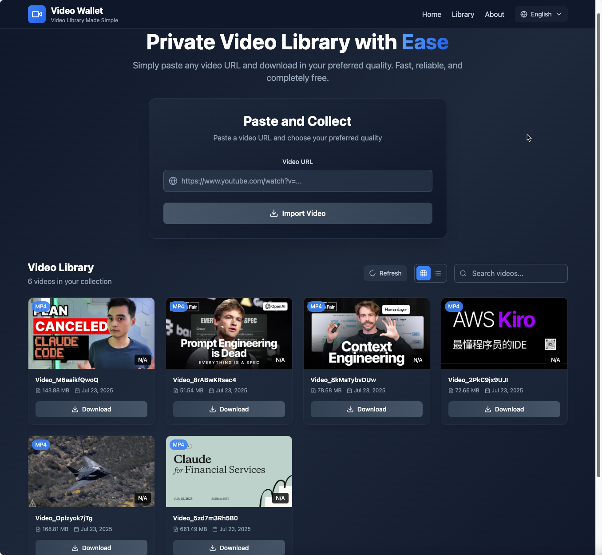
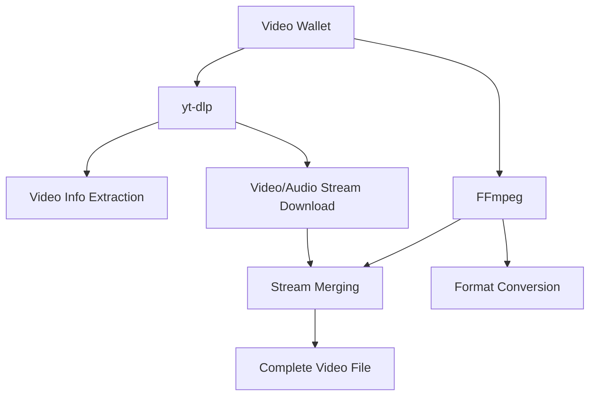

# Video Wallet

English | [中文](./README_CN.md)

Video Wallet is a modern web application for downloading and managing videos from various online platforms, built with React.js, Tailwind CSS, and FastAPI. Features video downloading capabilities using yt-dlp with automatic video/audio merging and safe filename handling.



## Project Structure

```
video-wallet/
├── src/
│   ├── web/          # React.js frontend with Tailwind CSS and TypeScript
│   └── server/       # FastAPI backend service
├── assets/           # Project assets and images
├── README.md
└── package.json      # Root package.json with convenience scripts
```

## Features

- 🎥 **Video Analysis**: Extract video information and available formats from URLs
- ⬇️ **Smart Download**: Download videos with automatic video/audio stream merging
- 📚 **Video Library**: Organize downloaded videos with metadata management
- 🔒 **Safe Filenames**: UUID-based filenames to avoid filesystem issues
- 🖼️ **Thumbnail Support**: Automatic thumbnail download and management
- 🌐 **Web Interface**: React-based frontend for easy video management
- 🔄 **Cross-Platform**: Works on Windows, macOS, and Linux
- 🎬 **Video Player**: Built-in video player for local playback
- 🌍 **Multi-language**: English and Chinese interface support

## System Requirements

- **Python 3.8+**
- **Node.js 16+**
- **ffmpeg** (for video/audio merging)
- **yt-dlp** (automatically installed with backend dependencies)

## Installation

### Prerequisites Installation

#### macOS (using Homebrew)

```bash
# Install Homebrew if not already installed
/bin/bash -c "$(curl -fsSL https://raw.githubusercontent.com/Homebrew/install/HEAD/install.sh)"

# Install dependencies
brew install python node ffmpeg

# Install yt-dlp
pip3 install yt-dlp
```

#### Ubuntu/Debian

```bash
# Update package list
sudo apt update

# Install Python, Node.js, and ffmpeg
sudo apt install python3 python3-pip nodejs npm ffmpeg

# Install yt-dlp
pip3 install yt-dlp
```

#### Windows

1. **Install Python**: Download from [python.org](https://www.python.org/downloads/)
2. **Install Node.js**: Download from [nodejs.org](https://nodejs.org/)
3. **Install ffmpeg**: 
   - Download from [ffmpeg.org](https://ffmpeg.org/download.html)
   - Add to system PATH
4. **Install yt-dlp**:
   ```cmd
   pip install yt-dlp
   ```

### Quick Setup (Recommended)

Use the convenience scripts from the root directory:

1. **Install all dependencies**:
   ```bash
   npm run setup
   ```

2. **Start frontend**:
   ```bash
   npm run dev:web
   ```

3. **Start backend** (in another terminal):
   ```bash
   npm run dev:server
   ```

### Manual Installation

#### Frontend Setup (React.js + Tailwind + TypeScript)

1. Navigate to web directory:
   ```bash
   cd src/web
   ```

2. Install dependencies:
   ```bash
   npm install
   ```

3. Start development server:
   ```bash
   npm run dev
   ```

   Frontend will be available at `http://localhost:6173`

#### Backend Setup (FastAPI)

1. Navigate to server directory:
   ```bash
   cd src/server
   ```

2. Create virtual environment (recommended):
   ```bash
   python -m venv venv
   source venv/bin/activate  # Windows: venv\Scripts\activate
   ```

3. Install dependencies:
   ```bash
   pip install -r requirements.txt
   ```

4. Start FastAPI server:
   ```bash
   python main.py
   ```

   API will be available at `http://localhost:6800`
   API Documentation: `http://localhost:6800/docs`

## Core Dependencies Explained

### FFmpeg - Video Processing Engine

**FFmpeg** is an open-source, cross-platform audio and video processing toolkit that serves as one of the core dependencies of this project.

#### Purpose and Importance
- **Video/Audio Merging**: Many video platforms (like Bilibili) provide separate video and audio streams, FFmpeg is responsible for merging them into complete video files
- **Format Conversion**: Supports conversion and processing of almost all audio and video formats
- **Quality Optimization**: Maintains optimal video quality and file size during the merging process

#### Installation Verification
```bash
# Check if FFmpeg is properly installed
ffmpeg -version

# Should display output similar to:
# ffmpeg version 7.1.1 Copyright (c) 2000-2025 the FFmpeg developers
```

#### Common Issues
- **ffmpeg command not found**: Ensure FFmpeg is added to system PATH environment variable
- **Permission issues**: May require administrator privileges on some systems
- **Version compatibility**: Recommend using version 4.0 or higher

### yt-dlp - Video Download Core

**yt-dlp** is an enhanced version of youtube-dl, a powerful video downloading tool.

#### Main Features
- **Multi-platform Support**: Supports 1000+ video websites including YouTube, Bilibili, TikTok, etc.
- **Format Selection**: Choose different video qualities and formats
- **Metadata Extraction**: Retrieve video titles, descriptions, thumbnails, and other information
- **Subtitle Download**: Supports automatic and manual subtitle downloads

#### Major Supported Platforms
- **YouTube** - World's largest video platform
- **Bilibili** - China's mainstream video platform
- **TikTok** - Short video platform
- **Weibo Video** - Social media videos
- **Youku, iQiyi, Tencent Video** - China's mainstream video platforms
- **Vimeo, Dailymotion** - International video platforms

#### Updates and Maintenance
```bash
# Update yt-dlp to latest version (recommended to run regularly)
pip install --upgrade yt-dlp

# Check version
yt-dlp --version

# View list of supported sites
yt-dlp --list-extractors
```

#### Advanced Configuration
yt-dlp supports rich configuration options:
- **Cookie Support**: For downloading videos that require login
- **Proxy Settings**: Support downloading through proxy servers
- **Speed Limiting**: Control download speed to avoid being rate-limited
- **Retry Mechanism**: Automatic retry when network is unstable

### Dependency Version Requirements

#### Backend Dependencies (Python)

```txt
fastapi>=0.104.1
uvicorn[standard]>=0.24.0
python-multipart>=0.0.6
yt-dlp>=2023.11.16
```

#### Frontend Dependencies (Node.js)

```json
{
  "react": "^18.2.0",
  "react-dom": "^18.2.0",
  "typescript": "^5.2.2",
  "tailwindcss": "^3.3.0",
  "vite": "^5.0.0",
  "lucide-react": "^0.294.0"
}
```

#### System Dependencies

- **ffmpeg 4.0+**: Video/audio merging and format conversion
- **yt-dlp 2023.11.16+**: Video downloading and analysis
- **Python 3.8+**: Backend runtime environment
- **Node.js 16+**: Frontend build tools and runtime

### Dependency Relationship



Project Workflow:
1. **yt-dlp** analyzes video URL and extracts available format information
2. **yt-dlp** downloads selected format video and audio streams
3. **FFmpeg** merges separate video and audio streams into complete video files
4. System saves merged videos to the video library

## Configuration

### Supported Platforms

This application supports downloading videos from any platform supported by yt-dlp, including:
- YouTube
- Bilibili
- Vimeo
- Dailymotion
- And many more (see [yt-dlp supported sites](https://github.com/yt-dlp/yt-dlp/blob/master/supportedsites.md))

### File Structure

```
video-wallet/
├── src/server/
│   ├── download_tmp/     # Temporary download files
│   ├── video_library/    # Saved videos with UUID filenames
│   ├── uploads/          # File uploads
│   └── outputs/          # Processed files
```

## Usage

1. Start both frontend and backend servers (see installation instructions above)
2. Open your browser and navigate to `http://localhost:6173`
3. Enter a video URL from a supported platform (e.g., YouTube, Bilibili)
4. Click "Analyze" to see available video formats and quality options
5. Select your preferred format and click "Download"
6. Once downloaded, the video will appear in your video library
7. Use the video library to:
   - Play videos locally
   - Download videos to your device
   - Manage your video collection

## API Endpoints

### Video Analysis and Download
- `POST /videopage_analyze` - Analyze video URL to extract available formats
- `POST /videopage_download` - Download specific video format with auto-merging
- `POST /videopage_save` - Save downloaded video to library with safe filenames

### Video Library Management
- `GET /videopage_list` - Get list of all saved videos
- `GET /videopage_file/{video_id}` - Serve video file by ID
- `GET /video_library/{filename}` - Serve video files directly
- `GET /download/{filename}` - Download processed files

## Development

### Frontend Development

The frontend is built with:
- **React.js 18** with TypeScript
- **Tailwind CSS** for styling and responsive design
- **Vite** for build tooling and development server
- **Lucide React** for icons
- **Multi-language support** (English/Chinese)
- **Context API** for state management

### Backend Development

The backend is built with:
- **FastAPI** as the web framework
- **Uvicorn** as the ASGI server
- **yt-dlp** for video downloading and analysis
- **ffmpeg** for video/audio merging
- **python-multipart** for file uploads
- **CORS middleware** for cross-origin requests

### Key Features Implemented

- ✅ Video URL analysis and format detection
- ✅ Multi-quality video downloading with auto-merging
- ✅ Thumbnail extraction and management
- ✅ Video library with metadata storage
- ✅ Local video playback
- ✅ Responsive UI with dark theme
- ✅ Multi-language interface
- ✅ Safe UUID-based filenames
- ✅ Cross-platform compatibility
- ✅ File serving and download capabilities

## Troubleshooting

### Common Issues

1. **ffmpeg not found**: Ensure ffmpeg is installed and in your system PATH
2. **yt-dlp errors**: Update yt-dlp to the latest version: `pip install --upgrade yt-dlp`
3. **Port conflicts**: Change ports in configuration if 6800 or 6173 are in use
4. **Permission errors**: Ensure write permissions for download directories

### Verification Commands

```bash
# Check if dependencies are installed
python --version
node --version
ffmpeg -version
yt-dlp --version

# Test backend API
curl http://localhost:6800/

# Check frontend build
cd src/web && npm run build
```

## License

MIT License