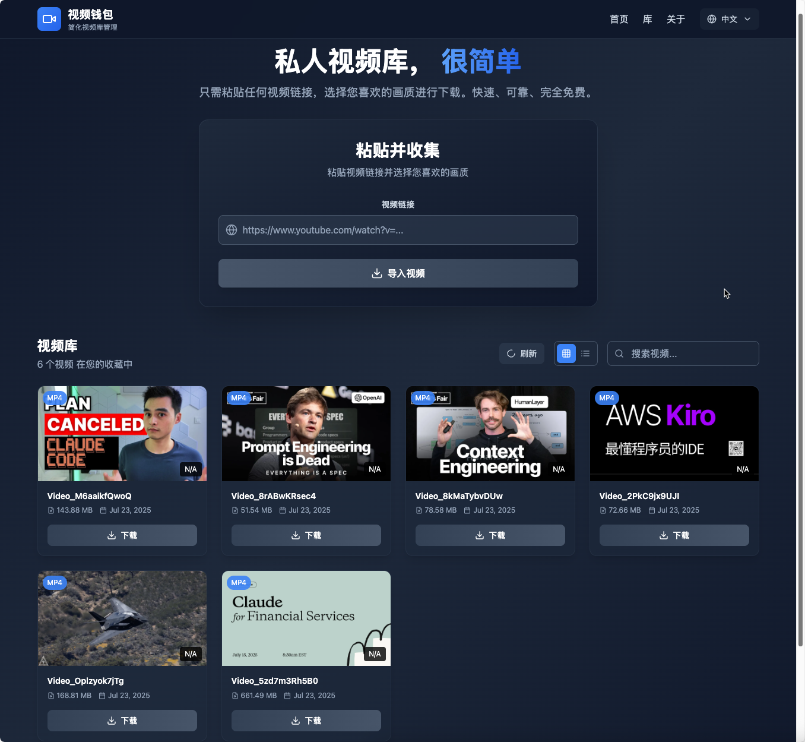
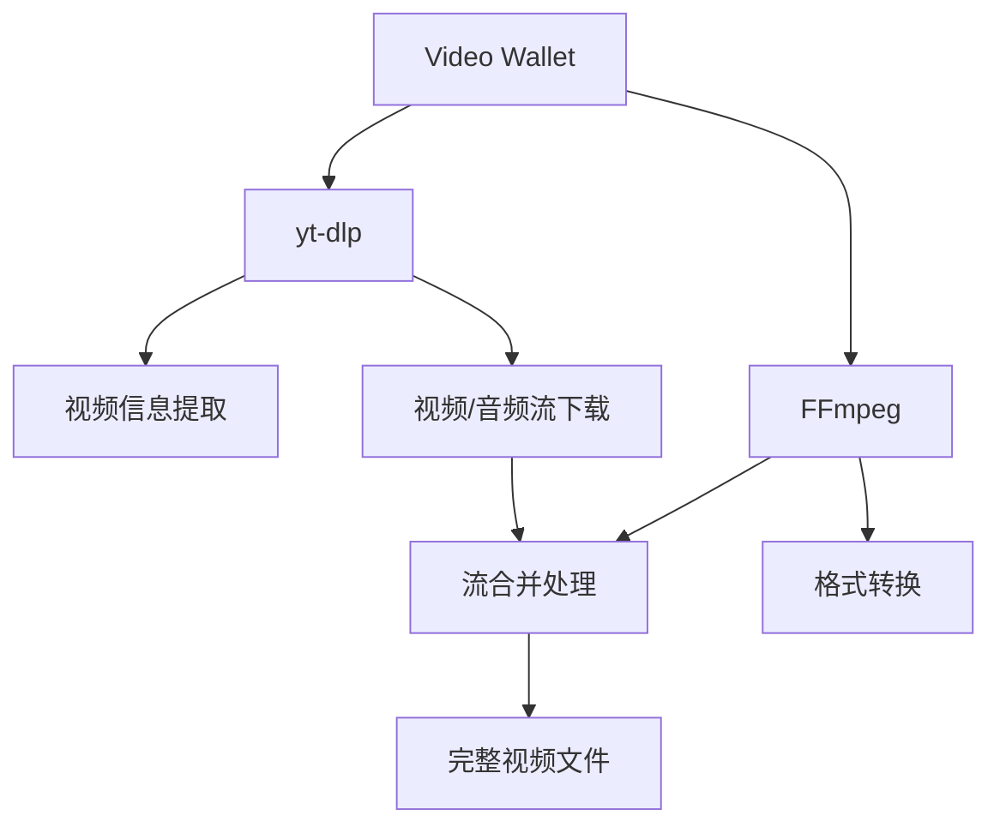

# Video Wallet

[English](./README.md) | 中文

Video Wallet 是一个现代化的网络应用程序，用于从各种在线平台下载和管理视频，使用 React.js、Tailwind CSS 和 FastAPI 构建。具备使用 yt-dlp 的视频下载功能，支持自动视频/音频合并和安全文件名处理。



## 项目结构

```
video-wallet/
├── src/
│   ├── web/          # React.js 前端，使用 Tailwind CSS 和 TypeScript
│   └── server/       # FastAPI 后端服务
├── assets/           # 项目资源和图片
├── README.md
└── package.json      # 根目录 package.json，包含便捷脚本
```

## 功能特性

- 🎥 **视频分析**：从 URL 提取视频信息和可用格式
- ⬇️ **智能下载**：自动视频/音频流合并下载
- 📚 **视频库**：使用元数据管理组织已下载的视频
- 🔒 **安全文件名**：基于 UUID 的文件名避免文件系统问题
- 🖼️ **缩略图支持**：自动缩略图下载和管理
- 🌐 **网页界面**：基于 React 的前端，便于视频管理
- 🔄 **跨平台**：支持 Windows、macOS 和 Linux
- 🎬 **视频播放器**：内置视频播放器，支持本地播放
- 🌍 **多语言**：英文和中文界面支持

## 系统要求

- **Python 3.8+**
- **Node.js 16+**
- **ffmpeg**（用于视频/音频合并）
- **yt-dlp**（随后端依赖自动安装）

## 安装说明

### 前置依赖安装

#### macOS（使用 Homebrew）

```bash
# 如果尚未安装 Homebrew，请先安装
/bin/bash -c "$(curl -fsSL https://raw.githubusercontent.com/Homebrew/install/HEAD/install.sh)"

# 安装依赖
brew install python node ffmpeg

# 安装 yt-dlp
pip3 install yt-dlp
```

#### Ubuntu/Debian

```bash
# 更新包列表
sudo apt update

# 安装 Python、Node.js 和 ffmpeg
sudo apt install python3 python3-pip nodejs npm ffmpeg

# 安装 yt-dlp
pip3 install yt-dlp
```

#### Windows

1. **安装 Python**：从 [python.org](https://www.python.org/downloads/) 下载
2. **安装 Node.js**：从 [nodejs.org](https://nodejs.org/) 下载
3. **安装 ffmpeg**：
   - 从 [ffmpeg.org](https://ffmpeg.org/download.html) 下载
   - 添加到系统 PATH
4. **安装 yt-dlp**：
   ```cmd
   pip install yt-dlp
   ```

### 快速安装（推荐）

使用根目录的便捷脚本：

1. **安装所有依赖**：
   ```bash
   npm run setup
   ```

2. **启动前端**：
   ```bash
   npm run dev:web
   ```

3. **启动后端**（在另一个终端中）：
   ```bash
   npm run dev:server
   ```

### 手动安装

#### 前端安装（React.js + Tailwind + TypeScript）

1. 进入 web 目录：
   ```bash
   cd src/web
   ```

2. 安装依赖：
   ```bash
   npm install
   ```

3. 启动开发服务器：
   ```bash
   npm run dev
   ```

   前端将在 `http://localhost:6173` 可用

#### 后端安装（FastAPI）

1. 进入 server 目录：
   ```bash
   cd src/server
   ```

2. 创建虚拟环境（推荐）：
   ```bash
   python -m venv venv
   source venv/bin/activate  # Windows: venv\Scripts\activate
   ```

3. 安装依赖：
   ```bash
   pip install -r requirements.txt
   ```

4. 启动 FastAPI 服务器：
   ```bash
   python main.py
   ```

   API 将在 `http://localhost:6800` 可用
   API 文档：`http://localhost:6800/docs`

## 核心依赖详解

### FFmpeg - 视频处理引擎

**FFmpeg** 是一个开源的跨平台音视频处理工具集，是本项目的核心依赖之一。

#### 作用和重要性
- **视频/音频合并**：许多视频平台（如哔哩哔哩）提供分离的视频流和音频流，FFmpeg 负责将它们合并成完整的视频文件
- **格式转换**：支持几乎所有音视频格式的转换和处理
- **质量优化**：在合并过程中保持最佳的视频质量和文件大小

#### 安装验证
```bash
# 检查 FFmpeg 是否正确安装
ffmpeg -version

# 应该显示类似输出：
# ffmpeg version 7.1.1 Copyright (c) 2000-2025 the FFmpeg developers
```

#### 常见问题
- **找不到 ffmpeg 命令**：确保 FFmpeg 已添加到系统 PATH 环境变量
- **权限问题**：在某些系统上可能需要管理员权限安装
- **版本兼容性**：建议使用 4.0 或更高版本

### yt-dlp - 视频下载核心

**yt-dlp** 是 youtube-dl 的增强版本，是一个功能强大的视频下载工具。

#### 主要功能
- **多平台支持**：支持 1000+ 视频网站，包括 YouTube、哔哩哔哩、抖音等
- **格式选择**：可以选择不同的视频质量和格式
- **元数据提取**：获取视频标题、描述、缩略图等信息
- **字幕下载**：支持自动字幕和手动字幕下载

#### 支持的主要平台
- **YouTube** - 全球最大的视频平台
- **哔哩哔哩 (Bilibili)** - 中国主流视频平台
- **抖音 (TikTok)** - 短视频平台
- **微博视频** - 社交媒体视频
- **优酷、爱奇艺、腾讯视频** - 中国主流视频平台
- **Vimeo、Dailymotion** - 国际视频平台

#### 更新和维护
```bash
# 更新 yt-dlp 到最新版本（推荐定期执行）
pip install --upgrade yt-dlp

# 检查版本
yt-dlp --version

# 查看支持的网站列表
yt-dlp --list-extractors
```

#### 高级配置
yt-dlp 支持丰富的配置选项：
- **Cookie 支持**：用于下载需要登录的视频
- **代理设置**：支持通过代理服务器下载
- **速度限制**：控制下载速度避免被限制
- **重试机制**：网络不稳定时自动重试

### 依赖版本要求

#### 后端依赖（Python）

```txt
fastapi>=0.104.1
uvicorn[standard]>=0.24.0
python-multipart>=0.0.6
yt-dlp>=2023.11.16
```

#### 前端依赖（Node.js）

```json
{
  "react": "^18.2.0",
  "react-dom": "^18.2.0",
  "typescript": "^5.2.2",
  "tailwindcss": "^3.3.0",
  "vite": "^5.0.0",
  "lucide-react": "^0.294.0"
}
```

#### 系统依赖

- **ffmpeg 4.0+**：视频/音频合并和格式转换
- **yt-dlp 2023.11.16+**：视频下载和分析
- **Python 3.8+**：后端运行时环境
- **Node.js 16+**：前端构建工具和运行时

### 依赖关系说明



本项目的工作流程：
1. **yt-dlp** 分析视频 URL，提取可用格式信息
2. **yt-dlp** 下载选定格式的视频流和音频流
3. **FFmpeg** 将分离的视频流和音频流合并成完整的视频文件
4. 系统将合并后的视频保存到视频库中

## 配置

### 支持的平台

此应用程序支持从 yt-dlp 支持的任何平台下载视频，包括：
- YouTube
- 哔哩哔哩（Bilibili）
- Vimeo
- Dailymotion
- 以及更多（参见 [yt-dlp 支持的网站](https://github.com/yt-dlp/yt-dlp/blob/master/supportedsites.md)）

### 文件结构

```
video-wallet/
├── src/server/
│   ├── download_tmp/     # 临时下载文件
│   ├── video_library/    # 使用 UUID 文件名保存的视频
│   ├── uploads/          # 文件上传
│   └── outputs/          # 处理过的文件
```

## 使用方法

1. 启动前端和后端服务器（参见上面的安装说明）
2. 打开浏览器并导航到 `http://localhost:6173`
3. 输入来自支持平台的视频 URL（如 YouTube、哔哩哔哩等）
4. 点击"分析"查看可用的视频格式和质量选项
5. 选择您偏好的格式并点击"下载"
6. 下载完成后，视频将出现在您的视频库中
7. 使用视频库可以：
   - 本地播放视频
   - 将视频下载到您的设备
   - 管理您的视频收藏

## API 端点

### 视频分析和下载
- `POST /videopage_analyze` - 分析视频 URL 以提取可用格式
- `POST /videopage_download` - 下载特定视频格式并自动合并
- `POST /videopage_save` - 使用安全文件名将下载的视频保存到库中

### 视频库管理
- `GET /videopage_list` - 获取所有已保存视频的列表
- `GET /videopage_file/{video_id}` - 通过 ID 提供视频文件
- `GET /video_library/{filename}` - 直接提供视频文件
- `GET /download/{filename}` - 下载处理过的文件

## 开发

### 前端开发

前端使用以下技术构建：
- **React.js 18** 配合 TypeScript
- **Tailwind CSS** 用于样式和响应式设计
- **Vite** 用于构建工具和开发服务器
- **Lucide React** 用于图标
- **多语言支持**（英文/中文）
- **Context API** 用于状态管理

### 后端开发

后端使用以下技术构建：
- **FastAPI** 作为 Web 框架
- **Uvicorn** 作为 ASGI 服务器
- **yt-dlp** 用于视频下载和分析
- **ffmpeg** 用于视频/音频合并
- **python-multipart** 用于文件上传
- **CORS 中间件** 用于跨域请求

### 已实现的关键功能

- ✅ 视频 URL 分析和格式检测
- ✅ 多质量视频下载并自动合并
- ✅ 缩略图提取和管理
- ✅ 带元数据存储的视频库
- ✅ 本地视频播放
- ✅ 深色主题的响应式 UI
- ✅ 多语言界面
- ✅ 安全的基于 UUID 的文件名
- ✅ 跨平台兼容性
- ✅ 文件服务和下载功能

## 故障排除

### 常见问题

1. **找不到 ffmpeg**：确保 ffmpeg 已安装并在系统 PATH 中
2. **yt-dlp 错误**：更新 yt-dlp 到最新版本：`pip install --upgrade yt-dlp`
3. **端口冲突**：如果 6800 或 6173 端口被占用，请在配置中更改端口
4. **权限错误**：确保下载目录具有写入权限

### 验证命令

```bash
# 检查依赖是否已安装
python --version
node --version
ffmpeg -version
yt-dlp --version

# 测试后端 API
curl http://localhost:6800/

# 检查前端构建
cd src/web && npm run build
```

## 许可证

MIT License